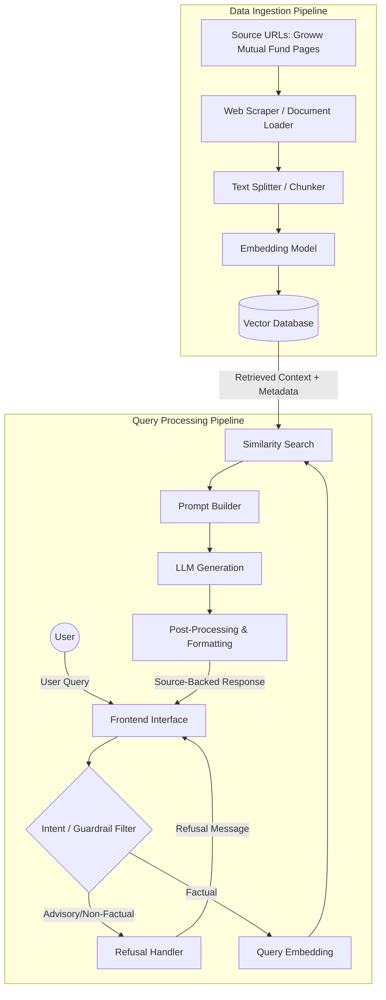

# Architecture Document: Mutual Fund FAQ Assistant

## 1. High-Level Architecture Overview
The system is built as a **Retrieval-Augmented Generation (RAG)** pipeline. It operates in two primary phases:
1. **Data Ingestion (Offline):** Extracting, processing, embedding, and storing factual information from the provided Groww mutual fund URLs.
2. **Query Processing (Online):** Handling user queries, applying guardrails, retrieving relevant context, and generating a compliant, facts-only response.

---

## 2. Component Details

### A. Data Ingestion Pipeline
This pipeline runs periodically (e.g., daily or weekly) to ensure the data is up-to-date.
* **Document Loaders:** Scrapes content directly from the curated list of Groww HDFC mutual fund URLs. Extracts text data and relevant fund details presented on the page.
* **Chunking Strategy:** Splits large documents into smaller, semantically meaningful chunks (e.g., 500-1000 tokens) with appropriate overlap to preserve context.
* **Metadata Attachment:** Every chunk is tagged with crucial metadata:
  * `source_url`: The exact link where the information was found.
  * `last_updated`: The timestamp of the scrape/document.
  * `scheme_name`: The specific mutual fund it relates to.
* **Embedding Model:** Converts the text chunks into dense vector representations (e.g., using OpenAI `text-embedding-3-small`, HuggingFace models).
* **Vector Database:** Stores the embeddings and metadata for fast similarity search (e.g., ChromaDB, FAISS, Qdrant, or Pinecone).

### B. Query Processing Pipeline (RAG)
When a user submits a query through the UI, this pipeline executes in real-time.
* **Intent/Guardrail Filter:** A lightweight classification step (either rules-based, NLP classifier, or a fast LLM call) to determine if the query is asking for financial advice (e.g., "Which is better?"). 
  * If **Advisory**, it routes to the Refusal Handler.
  * If **Factual**, it proceeds to retrieval.
* **Retrieval:** The user's query is embedded using the same model used during ingestion. A similarity search (Cosine Similarity/L2) is performed against the Vector DB to fetch the top `K` most relevant chunks.
* **Prompt Builder:** Constructs the prompt using:
  1. The retrieved chunks (Context).
  2. The User Query.
  3. System Instructions (Constraints: 3 sentences max, no advice, include source link).
* **LLM Generation:** The language model (via Groq API) generates the response strictly based on the provided context.
* **Post-Processing:** Appends the required footer format: `"Last updated from sources: <date>"` and ensures the citation link is properly formatted.

### C. Refusal Handler
Responsible for politely declining non-factual queries.
* Returns a standard response reinforcing the facts-only limitation.
* Appends an educational link (e.g., pointing to AMFI's investor education portal).

### D. User Interface (Frontend)
A minimalistic web interface (built with Streamlit, Gradio, or React) containing:
* **Welcome Message:** Explaining the bot's purpose.
* **Example Questions:** 3 clickable pre-defined queries (e.g., "What is the exit load for HDFC Mid-Cap Fund?").
* **Chat Window:** For the user to input queries and view responses.
* **Disclaimer:** Prominently displayed: *"Facts-only. No investment advice."*

---

## 3. Technology Stack Recommendations
* **Frontend:** Streamlit (for fast prototyping) or React (for production).
* **Orchestration Framework:** LangChain or LlamaIndex.
* **Vector Database:** ChromaDB (local/lightweight) or Pinecone (managed).
* **Embeddings:** OpenAI `text-embedding-3-small` or BGE-large-en.
* **LLM:** Groq (e.g., `llama3-8b-8192` or `mixtral-8x7b-32768`) for fast, capable inference and formatting.

---

## 4. Security & Privacy Considerations
* **No PII Collection:** The frontend will not request or store any personal identifiers, PAN, Aadhaar, account details, or OTPs.
* **Statelessness:** The assistant does not need to maintain long-term user session histories, minimizing privacy risks.
* **Hallucination Mitigation:** The prompt will explicitly instruct the LLM to output "I do not have this information" if the answer is not present in the retrieved context, preventing speculative answers.
